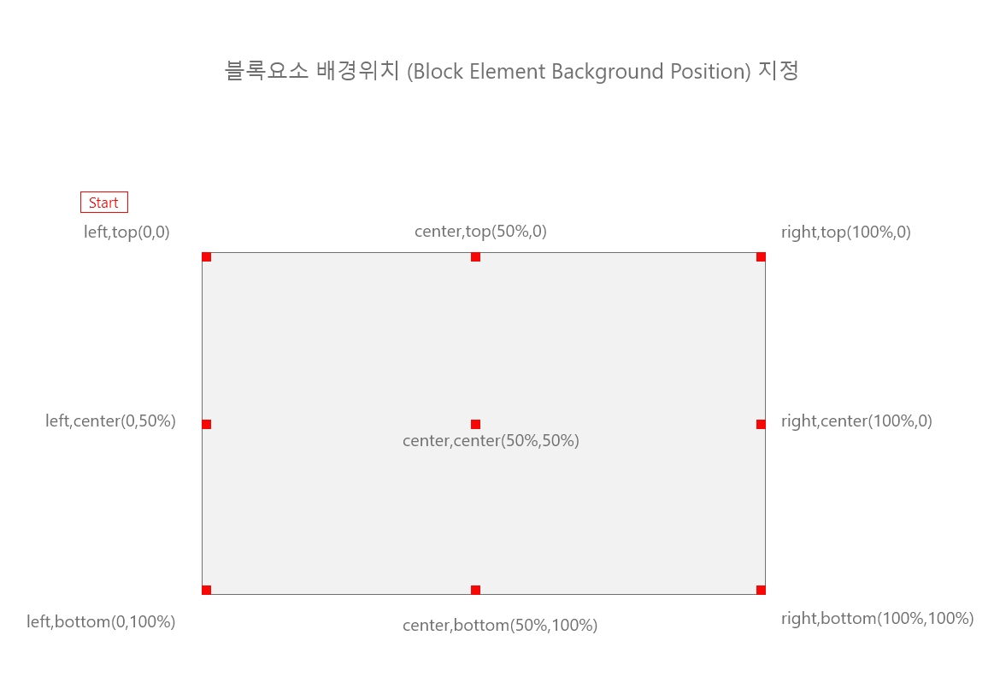

# CH05.  칼라 & 배경 관련속성

<br>
<br>

CSS를 사용하면 웹 페이지의 색상과 배경을 다양하게 설정할 수 있습니다. 여기에서는 색상 설정, 배경 이미지 설정, 그라데이션에 대해 소개하겠습니다.

<br>

## 1. Color 관련속성

`color` 속성은 텍스트의 색상을 지정하는 데 사용됩니다. 다양한 색상 표현 방법이 있으며, 주로 다음과 같은 방법을 사용합니다:

<br>

- **칼라 이름**: `red`, `blue`, `green` 등
- **16진수(Hex)**: `#ff0000`, `#00ff00` 등
- **RGB**: `rgb(255, 0, 0)`, `rgb(0, 255, 0)` 등
- **RGBA**: `rgba(255, 0, 0, 0.5)` (알파 값 포함, 투명도 설정)
- **HSL**: `hsl(0, 100%, 50%)`
- **HSLA**: `hsla(0, 100%, 50%, 0.5)` (색상, 명도, 채도 포함, 투명도 설정)

<br>  

```
p {
    color: #ff0000; /* 텍스트 색상을 빨간색으로 설정 */
}
```

<br>
<br>

## 2. Background 관련속성  

<br>

CSS에서는 요소의 배경을 다양한 방식으로 설정할 수 있도록 여러 속성을 제공합니다. 여기에서는 배경 처리를 위한 5가지 주요 속성에 대해 소개하겠습니다: `background-color`, `background-image`, `background-repeat`, `background-position`, `background-size`.

<br>

### 1)  `background-color`

`background-color` 속성은 요소의 배경 색상을 지정합니다. 색상은 이름, 16진수, RGB, RGBA, HSL, HSLA 등의 형식으로 설정할 수 있습니다.
  

```
div {
    background-color: #ffcc00; /* 배경 색상을 노란색으로 설정 */
}
```
<br>

### 2)  `background-image`

`background-image` 속성은 요소의 배경에 이미지를 설정합니다. URL 경로를 사용하여 이미지를 지정합니다.

  

```
div {
    background-image: url('background.jpg'); /* 배경 이미지 설정 */
}
```

<br>  

### 3)  `background-repeat`

`background-repeat` 속성은 배경 이미지가 요소 안에서 반복되는 방식을 지정합니다.

<br>

- `repeat`: 기본값. 이미지가 가로 세로로 반복됩니다.
- `repeat-x`: 이미지가 가로로만 반복됩니다.
- `repeat-y`: 이미지가 세로로만 반복됩니다.
- `no-repeat`: 이미지가 반복되지 않습니다.

<br>

```
div {
    background-image: url('background.jpg');
    background-repeat: no-repeat; /* 이미지가 반복되지 않도록 설정 */
}
```

<br>

### 4)  `background-position`

`background-position` 속성은 배경 이미지의 위치를 지정합니다. 키워드, 길이, 백분율 값 등을 사용할 수 있습니다.

<br>

- 키워드: `top`, `right`, `bottom`, `left`, `center`
- 길이: `50px 100px` (가로 50픽셀, 세로 100픽셀)
- 백분율: `50% 50%` (가로 50%, 세로 50%)

<br>

```
div {
    background-image: url('background.jpg');
    background-position: center; /* 이미지 위치를 중앙으로 설정 */
}
```

<br> 

### 5)  `background-size`

`background-size` 속성은 배경 이미지의 크기를 지정합니다.

<br>

- `auto`: 기본값. 이미지의 원본 크기.
- `cover`: 요소를 완전히 덮도록 이미지 크기 조정.
- `contain`: 이미지 전체가 요소 안에 맞도록 크기 조정.
- 구체적인 크기: `100px 50px` (가로 100픽셀, 세로 50픽셀)
- 백분율: `100% 100%` (요소의 크기에 맞춰 조정)

<br>

```
div {
    background-image: url('background.jpg');
    background-size: cover; /* 이미지가 요소를 완전히 덮도록 설정 */
}
```

<br>
<br>

### 6) 종합 예제 코드

다음은 위에서 설명한 모든 배경 속성을 포함한 종합 예제입니다.

<br>

```
<!DOCTYPE html>
<html lang="en">
<head>
    <meta charset="UTF-8">
    <meta name="viewport" content="width=device-width, initial-scale=1.0">
    <title>배경 처리 속성 예제</title>
    <style>
        .background-example {
            width: 300px;
            height: 200px;
            background-color: #ffcc00; /* 배경 색상 */
            background-image: url('background.jpg'); /* 배경 이미지 */
            background-repeat: no-repeat; /* 이미지 반복 설정 */
            background-position: center; /* 이미지 위치 설정 */
            background-size: cover; /* 이미지 크기 설정 */
            border: 1px solid #000; /* 경계선 설정 */
            margin: 20px;
        }
    </style>
</head>
<body>
    <h1>배경 처리 속성 예제</h1>
    <div class="background-example">
        배경 이미지가 설정된 박스
    </div>
</body>
</html>
```

<br>

이 예제는 `background-color`, `background-image`, `background-repeat`, `background-position`, `background-size` 속성을 사용하여 배경을 설정한 결과를 보여줍니다. 각 속성이 요소의 배경을 어떻게 변화시키는지 확인할 수 있습니다.

  
<br>
  



  
<br>
<br>
  

## 3. Gradient 관련속성


그라데이션은 두 개 이상의 색상이 부드럽게 전환되는 배경을 만드는 데 사용됩니다. 주로 `linear-gradient`와 `radial-gradient`가 사용됩니다.

<br>

### 1)  linear-gradient

`linear-gradient` 속성은 선형 그라데이션을 설정합니다. 시작 색상과 끝 색상을 지정하여 선형으로 색상이 전환되도록 합니다.
  

```
div {
    background: linear-gradient(to right, red, yellow); /* 왼쪽에서 오른쪽으로 빨간색에서 노란색으로 전환 */
}
```

<br>  

### 2) radial-gradient

`radial-gradient` 속성은 방사형 그라데이션을 설정합니다. 중심에서 시작하여 원형으로 색상이 전환됩니다.
 

```
div {
    background: radial-gradient(circle, red, yellow); /* 중심에서 원형으로 빨간색에서 노란색으로 전환 */
}
```