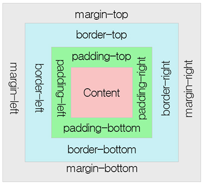
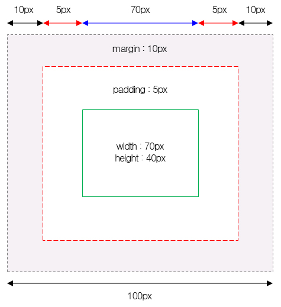

# CH06.  마진(Margin) & 패딩(Padding)  

<br>
<br>

## 1. 박스모델(Box Model)     

모든 HTML 요소는 박스(box) 모양으로 구성되며, 이것을 박스 모델(box model)이라고 부릅니다. 박스 모델은 HTML 요소를 패딩(padding), 테두리(border), 마진(margin), 그리고 내용(content)으로 구분합니다.

<br>

### 1) 박스모델의 구성



<br> 

### 2) 블록 요소의 높이와 너비 구하기

  



<br>
<br>  

## 2. 마진 속성(Margin Attribute) - 블록 요소의 외부여백 지정 속성  

CSS에서는 HTML 요소의 마진 영역을 설정하기 위해 다음과 같은 속성을 제공합니다. margin 속성값을 inherit로 설정하면, 부모(parent) 요소의 margin 속성값을 그대로 물려받습니다.

  

대표속성으로 마진선언시 마진의 선언 방향을 'top, right, bottom, left' 순으로 시계방향으로 순차적으로 설정됩니다.

<br>

### 기본 예제(Default example)

CSS에서 사용할 수 있는 Margin 속성은 다음과 같습니다.

  

#### \[ CSS Source Code \]

```
// 1. 개별속성 선언 방법					
  1. margin-top      :  블록요소 위쪽(top) 여백 지정
  2. margin-right    :  블록요소 오른쪽(right) 여백 지정
  3. margin-bottom   :  블록요소 아래쪽(bottom) 여백 지정
  4. margin-left     :  블록요소 왼쪽(left) 여백 지정
	
// 2. 대표속성 선언 방법	
  margin: top right bottom left;  <- ex) margin: 10px 10px 10px 10px;  
	
// 3. 마진속성의 축약표현
  1. margin: top right bottom left;  <- ex) margin: 10px 10px 10px 10px;  
  2. margin: top (left,right) bottom;  <- ex) margin: 10px 10px 10px;  
  3. margin: (top,bottom) (right,left);  <- ex) margin: 10px 10px;  
  4. margin: (top, right, bottom, left);  <- ex) margin: 10px;  
	
// 4. margin 속성값에 auto를 사용하는 이유
  - margin 속성값을 auto로 설정하면, 웹 브라우저가 수평 방향 마진(margin) 값을 자동으로 설정합니다. 
    즉, 해당 HTML 요소의 왼쪽과 오른쪽 마진을 자동으로 설정하게 됩니다. 그 결과 해당 요소는 그 요소를 포함하고 있는 부모(parent) 요소의 정중앙에 위치하게 됩니다.
```

<br>
<br>

## 3. 패딩 속성(Padding Attribute)  -  블록 요소의 내부여백 지정 속성
 
padding 속성은 내용(content)과 테두리(border) 사이의 간격인 패딩 영역의 크기를 설정합니다. 이러한 패딩 영역은 background-color 속성으로 설정하는 배경색의 영향을 함께 받습니다. CSS를 사용하면 패딩 영역의 크기를 방향별로 따로 설정할 수 있습니다.

<br>

### 기본 예제(Default example)

CSS에서 사용할 수 있는 Padding 속성은 다음과 같습니다.
 

#### \[ HTML Source Code \]

```
 // 1. 개별속성 선언 방법					
  1. padding-top      :  블록요소 내부의 위쪽(top) 여백 지정
  2. padding-right    :  블록요소 내부의 오른쪽(right) 여백 지정
  3. padding-bottom   :  블록요소 내부의 아래쪽(bottom) 여백 지정
  4. padding-left     :  블록요소 내부의 왼쪽(left) 여백 지정
	
  // 2. 대표속성 선언 방법	
  padding: top right bottom left;  <- ex) padding: 10px 10px 10px 10px;  
	
  // 3. 패딩의 축약표현
  1. padding: top right bottom left;  <- ex) padding: 10px 10px 10px 10px;  
  2. padding: top (left,right) bottom;  <- ex) padding: 10px 10px 10px;  
  3. padding: (top,bottom) (right,left);  <- ex) padding: 10px 10px;  
  4. padding: (top, right, bottom, left);  <- ex) padding: 10px;  
```

<br>
<br>

## 4\. 선관련 속성(Border Attribute)  -  테두리선을 꾸밀 때 사용하는 속성
 
border 속성은 내용(content)과 패딩(padding) 영역을 둘러싸는 테두리의 스타일을 설정합니다.

<br>

### 기본 예제(Default example)

CSS에서 사용할 수 있는 Border 속성은 다음과 같습니다.

<br>

#### \[ CSS Source Code \]

```
  // 1. 개별속성 선언 방법
  1) border-style          :   선의 모양 지정
  - 4개의 border-style 속성값을 가질 때는 top, right, bottom, left 순으로 설정합니다. 	
  - dotted : 선의 모양을 점선으로 설정함.
  - dashed : 선의 모양을 약간 긴 점선으로 설정함.
  - solid : 선의 모양을 실선으로 설정함.
  - double : 선의 모양을 이중 실선으로 설정함.
  - groove : 선의 모양을 3차원인 입체적인 선으로 설정하며, border-color 속성값에 영향을 받음.
  - ridge : 선의 모양을 3차원인 능선효과가 있는 선으로 설정하며, border-color 속성값에 영향을 받음.
  - inset : 선의 모양을 3차원인 내지로 끼운 선으로 설정하며, border-color 속성값에 영향을 받음.
  - outset : 선의 모양을 3차원인 외지로 끼운 선으로 설정하며, border-color 속성값에 영향을 받음.
  - none : 선의 모양을 없앰.
  - hidden : 선이 존재하기는 하지만 표현되지는 않음.

  2) border-width      :   선의 두께
  - px, em, cm 등과 같은 CSS 크기 단위를 이용하여 두께를 직접 설정할 수 있습니다. 
  - 미리 설정해 놓은 예약어인 thin, medium, thick을 사용하여 설정할 수도 있습니다.

  3) border-color      :   선의 색상   
  - 기본적인 color 속성값들뿐만 아니라 투명한 선을 나타내는 transparent 속성값을 사용할 수도 있습니다.


  // 2. 대표속성 선언 방법
  border : 선두께 선종류 선색상;  <- ex) border: 1px solid #000;  /  border-top: 1px solid #000;
```