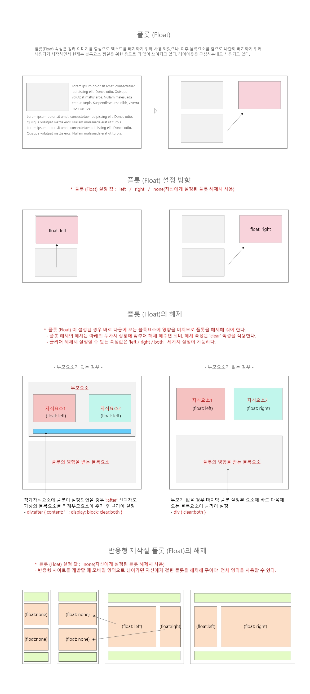

# CH07.  플롯(Float)

<br>
<br>  

## Float Attribute   \-   [샘플보기1](http://wdschools.co.kr/gate/classroom/chapter2-css3/page/sample/css/test6.html)  |  [샘플보기2](http://wdschools.co.kr/gate/classroom/chapter2-css3/page/sample/css/test6-1.html)

<br>

플롯속성은 원래 이미지를 기준으로 글자를 옆으로 흐르도록 배치하기 위해 사용되어 지다가, 차츰 블록요소들을 수평배치하는데 쓰여지기 시작하면서, 현재는 블록요소들을 수평배치하거나 웹 페이지의 레이아웃(layout)을 작성할 때 자주 사용됩니다.
  

그리고 'Float'을 설정할 경우 설정된 그 다음에 오는 요소들이 플롯의 영향을 받아 원치 않는 결과가 생길수 있으므로, 'Float' 속성이 적용된 후 나타나는 요소들이 더 이상 'Float' 속성에 영향을 받지 않도록 플롯을 해제해주는 것이 필요합니다. 이 때 사용하는 속성이 바로 'clear' 속성입니다
  
<br>

### 기본 예제(Default example)

CSS에서 사용할 수 있는 Float 속성은 다음과 같습니다.

  

#### \[ CSS Source Code \]

```
<style>
  img { float: left; margin-right: 20px; }
</style>
```

<br>
<br>

