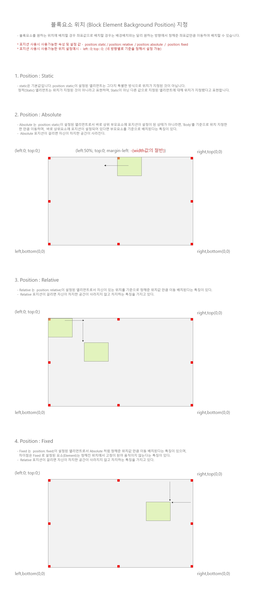

# CH09.  CSS Position 속성

 
 

CSS의 `position` 속성은 HTML 요소의 배치 방법을 제어합니다. 이 속성을 사용하면 요소가 문서의 다른 부분에 상대적으로 어디에 위치할지 정의할 수 있습니다. `position` 속성에는 여러 값이 있지만, 여기서는 `static`, `absolute`, `relative`, `fixed`의 4가지 주요 값에 대해 소개하겠습니다.

 

### Position 속성의 주요 값

1. **static**: 기본값입니다. 요소는 일반적인 문서 흐름에 따라 배치됩니다.
2. **relative**: 요소는 일반적인 문서 흐름에 따라 배치되지만, `top`, `right`, `bottom`, `left` 속성을 사용하여 자기 자신의 원래 위치를 기준으로 이동할 수 있습니다.
3. **absolute**: 요소는 일반적인 문서 흐름에서 제거되고, 가장 가까운 위치 지정 조상 요소 (relative, absolute, fixed, sticky 속성을 가진 조상 요소)를 기준으로 배치됩니다. 조상 요소가 없으면 `<html>`을 기준으로 합니다.
4. **fixed**: 요소는 일반적인 문서 흐름에서 제거되고, 브라우저 창을 기준으로 배치됩니다. 스크롤을 해도 위치가 변하지 않습니다.
  
   

### Position 속성 비교 표

| 속성 값 | 설명  | 기준  | 문서 흐름에서 제거 여부 | 스크롤 시 위치 변화 |
| --- | --- | --- | --- | --- |
| `static` | 기본 위치. 일반적인 문서 흐름에 따라 배치됩니다. | 없음  | 아니요 | 네   |
| `relative` | 일반적인 문서 흐름에 따라 배치되지만, 자신의 원래 위치를 기준으로 이동할 수 있습니다. | 자신의 원래 위치 | 아니요 | 네   |
| `absolute` | 일반적인 문서 흐름에서 제거되고, 가장 가까운 위치 지정 조상 요소를 기준으로 배치됩니다. | 위치 지정 조상 요소 | 예   | 아니요 |
| `fixed` | 일반적인 문서 흐름에서 제거되고, 브라우저 창을 기준으로 배치됩니다. | 브라우저 창 | 예   | 아니요 |

 
 
 

