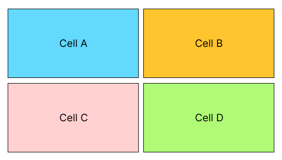

# CH13.  Grid Layout

<br>
<br>

CSS3의 `display: grid` 속성은 강력한 2차원 레이아웃 시스템을 제공합니다. 이에 대해 자세히 설명드리겠습니다:

<br>

## 1. 기본 개념:

- Grid 컨테이너와 Grid 아이템으로 구성됩니다.
- 행과 열을 정의하여 격자 구조를 만듭니다.
  
<br>
<br>

## 2. Grid 선언

CSS3 그리드 레이아웃을 사용하려면, 다른 요소를 감싸는 태그에 display: grid를 선언해야 합니다.

   

```
<!DOCTYPE html>
<html>
 <head>
  <title>CSS 그리드 시스템</title>
  <style>
  .container {
    display: grid; 
    /* CSS3 그리드 레이아웃을 선언합니다. */
  }
  </style>
 </head>
 <body>
  <div class="container">
    <div class="cell-a">cell a</div>
    <div class="cell-b">cell b</div>
    <div class="cell-c">cell c</div>
    <div class="cell-d">cell d</div>
  </div>
 </body>
</html>
```

<br>
<br>

## 3. 그리드 나누기

display 속성에 grid를 선언하였으면 grid-template-columns 속성을 지정하도록 합니다. Width는 각 200픽셀 크기로 2개 나누고 싶다면, 아래와 같이 입력합니다.

  

```
<!DOCTYPE html>
<html>
 <head>
  <title>CSS 그리드 시스템(1)</title>
  <style>
    .container1 {
      /* CSS3 그리드 레이아웃을 선언합니다. */
      display: grid;

      /* 세로로 200픽셀씩 자릅니다. */
      grid-template-columns: 200px 200px;

      gap: 10px;
      margin-bottom: 50px;
    }

    .container2 {
      width: 500px;
      display: grid; 

      grid-template-columns: 2fr 1fr;

      gap: 10px;
      margin-bottom: 50px;
    }

    .container3 {
      width: 500px;
      display: grid; 

      /* grid-template-columns: 1fr 1fr;
      grid-template-rows: 1fr 2fr; */

      /* 단축비율 설정 */
      grid-template: 1fr 2fr / 1fr 1fr;

      gap: 10px;
      margin-bottom: 50px;
    }

    [class *= cell] {
      box-sizing: border-box;
      border: 1px solid #000;
      padding: 20px;
      text-align: center;
      font-weight: bold;
    }

    .cell-a{
      background-color: #59c5e6;
    }
    .cell-b{
      background-color: #f3bb2c;
    }
    .cell-c{
      background-color: #fccece;
    }
    .cell-d{
      background-color: #98d967;
    }
  </style>
 </head>
 <body>
  <div class="container1">
    <div class="cell-a">Cell A</div>
    <div class="cell-b">Cell B</div>
    <div class="cell-c">Cell C</div>
    <div class="cell-d">Cell D</div>
  </div>

  <div class="container2">
    <div class="cell-a">Cell A</div>
    <div class="cell-b">Cell B</div>
    <div class="cell-c">Cell C</div>
    <div class="cell-d">Cell D</div>
  </div>

  <div class="container3">
    <div class="cell-a">Cell A</div>
    <div class="cell-b">Cell B</div>
    <div class="cell-c">Cell C</div>
    <div class="cell-d">Cell D</div>
  </div>
 </body>
</html>
```

<br>

이를 실행하면, 다음과 같이 출력합니다. 

<br>

  

<br>
<br>
  

### 1) 수평 비율 설정

grid-template-columns 속성에는 비율의 단위로 fr 를 사용할 수 있습니다. grid-template-columns 속성에 지정된 fr 단위의 합을 기반으로 비율을 지정한다고 생각하세요. 

예를 들어 2:1의 비율로 나누고 싶다면, 다음과 같이 입력합니다.
  

```
.container {
  display: grid; 
  grid-template-columns: 2fr 1fr;
}
```

<br>

다음은 결과 화면입니다.  

  
  
<br>  

일부 요소의 크기를 픽셀 단위 등으로 고정할 수도 있습니다.

```
.container {
  display: grid;
  grid-template-columns: 300px 1fr;
}
```

<br>

실행하면 다음과 같이 출력됩니다.  

`⁠`  

<br>
<br>

### 2) 수직 비율 설정  

CSS3의 그리드 시스템에는 grid-template-rows 라는 속성도 있습니다. 이는 가로로 자를 때 사용 합니다. 만약 다음과 같은 코드를 사용한다면, 가로로 나뉜 그리드의 높이가 1:2 비율로 지정됩니다.

```
.container {
  display: grid;
  grid-template-columns: 300px 300px;
  grid-template-rows: 1fr 2fr;
}
```

<br>

다음은 결과 화면입니다.  

  
  

이와 같은 방법으로 그리드를 나누는 것이 CSS3 그리드 레이아웃의 기본입니다. 

<br>
<br>  

### 3) 단축 비율 설정  

단축 형태의 코드를 사용할 수도 있습니다. 예를 들면 위 코드를 아래와 같이 짧게 작성할 수도 있습니다. 

순서는 <grid-template-rows>/<grid-templatecolumns> 입니다. 처음 보면 나눗셈으로 잘못 해석해버리는 경우가 있으므로, 기억해두는 것이 좋겠습니다.

  <br>

```
.container {
  display: grid;
  grid-template: 300px 300px / 1fr 2fr;
}
```

<br>
<br>

### 4) 그리드 갭 설정

참고로 grid-gap 속성으로 GutterWidth도 지정할 수 있습니다.

```
.container {
  display: grid;
  grid-template-columns: 300px 300px;
  grid-template-rows: 1fr 2fr;
  /* GapWidth를 5픽셀로 지정합니다. */
  grid-gap: 20px;
}
```

<br>

이를 설정하고 실행하면 다음 결과를 얻을 수 있습니다. 

  

  

  

<br>
<br>

## 3. 그리드 셀 배치하기

그리드 위에 배치되는 요소를 "셀(Sell)"이라고 부릅니다. 

<br>

MS 워드 등을 사용해보면, "셀 병합"이라는 기능이 있습니다. 이처럼 CSS 그리드 레이아웃도 요소를 여러 셀에 걸쳐 출력할 수 있습니다. 어떤 식으로 사용되는지 이해하기 위해, 먼저 다음 그림을 살펴봅시다. 

<br>

  
  
<br>
  
그리드를 구성하는 각각의 선에 숫자가 붙어 있습니다. 이 숫자를 기억하여 다음 코드를 살펴 봅시다.

  

```
<!DOCTYPE html>
<html>
 <head>
  <title>CSS 그리드 시스템(2)</title>
  <style>
  .container {
    display: grid;
    grid-template: 200px 200px 200px / 200px 200px 200px;
    grid-gap: 10px;
  }

  [class *= cell] {
    box-sizing: border-box;
    border: 1px solid #000;
    text-align: center;
    font-weight: bold;
    display: flex;
    justify-content: center;
    align-items: center;
  }

  .cell-a{
    background-color: #59c5e6;
  }
  .cell-b{
    background-color: #f3bb2c;
  }
  .cell-c{
    background-color: #fccece;
  }
  .cell-d{
    background-color: #98d967;
  }

  .cell-a {
    /* 행(가로)으로 1 ~ 4 번까지 차지합니다. */
    grid-row-start: 1;
    grid-row-end: 4;
    /* 열(세로)로 1 ~ 3 번까지 차지합니다. */
    grid-column-start: 1;
    grid-column-end: 3;
  }
  </style>
 </head>
 <body>
  <div class="container">
    <div class="cell-a">Cell A</div>
    <div class="cell-b">Cell B</div>
    <div class="cell-c">Cell C</div>
    <div class="cell-d">Cell D</div>
  </div>
 </body>
</html>
```

<br>

위 코드를 실행하면 다음의 결과를 얻을 수 있습니다. 

<br>

  

<br>

grid-column-start, grid-column-end 속성은 열(column: 세로줄)에서 어디부터 어디까지 차지하게 할 것인가 이고, 

grid-row-start, grid-row-end: 속성은 행(row: 가로줄)에서 어디부터 어디까지 차지하게 할 것인가를 지정하는 속성입니다. 

  
CSS3 그리드 시스템은 다음과 같은 과정을 거쳐 요소를 배치한다고 생각하면 쉽습니다. 

1. grid-template-columns, grid-template-rows 속성으로 그리드를 나눕니다. 
2. grid-column-start, grid-column-end, grid-row-start, grid-row-end 속성이 적용된 요소의 크기를 지정합니다. 
3. 나머지 요소를 차례로 배치합니다. 

<br>

따라서 . Cell A 라는 요소가 먼저 화면에 배치되고, 나머지 요소들이 화면을 채우게 됩니다. 

<br>  

참고로 위 코드를 아래와 같이 짧게 작성할 수도 있습니다. 마찬가지로 처음 보면 나눗셈으로 잘못 해석 해버리는 경우가 있으므로 기억해 두는 것이 좋겠습니다.

<br>

```
.cell-b {
  grio-row; 1 / 4;
  grid-column: 1 / 3;
}
```

<br>

이제 아래 그림처럼 그리드를 만들어 보겠습니다. 

<br>

  

<br>

이때는 다음과 같은 형태를 사용할 수 있습니다.   

```
<!DOCTYPE html>
<html>
  <head>
   <title>CSS 그리드 시스템</title>
   <style>
     * {
       /* 초기화 */
       margin: 0;
       padding: 0;
     }

     h1, h2{
      font-size: 20px;
     }

     .container {
       /* 너비 고정 and 중앙 정렬 */
       width: 960px;
       margin: 0 auto;
       padding-top: 10px;

       /* 그리드 구성하기 */
       display: grid;
       grid-template: 70px 1fr 70px / 200px 1fr;
       grid-gap: 5px;
     }

     [class *= cell] {
       box-sizing: border-box;
       border: 1px solid #000;
       padding: 10px; 
     }

     .cell-header {
       grid-column: 1 / 3;
     }
     .cell-footer {
       grid-column: 1 / 3;
     }
   </style>
  </head>
  <body>
    <div class="container">
      <div class="cell-header">
        <h1>Header</h1>
      </div>
      <div class="cell-aide">
        <h2>Aside</h2>
        <p>Lorem ipsum</p>
        <p>Lorem ipsum dolor sit amet, </p>
      </div>
      <div class="cell-content">
        <h1>Lorem ipsum dolor sit amet</h1>
        <p>Lorem ipsum dolor sit amet</p>
        <p>n hac habitasse platea dictumst.</p>
      </div>
      <div class="cell-footer">
        <h1>Footer</h1>
      </div>
    </div>
  </body>
</html>
```

<br>
<br>  

## 3. 그리드 셀 문자열로 배치하기

grid-template-areas 속성과 grid-area 속성을 조합하면, 이전의 다른 방법과 완전히 다른 형태로 요소를 배치할 수 있습니다. 

<br>

이전의 grid-template-areas 속성과 grid-area 속성으로 구성하면 다음과 같습니다.


```
<!DOCTYPE html>
<html>
 <head>
   <title>CSS 그리드 시스템</title>
   <style>
     * {
       /* 초기화 */
       margin: 0;
       padding: 0;
     }

     h1, h2 {
       text-align: center;
       font-size: 20px;
     }

     .container {
       /* 너비 고정 and 중앙 정렬 */
       width: 960px;
       margin: 0 auto;

       /* 그리드 구성하기 */
       display: grid;
       grid-template: 70px 1fr 70px / 200px 1fr;
       grid-gap: 5px;

       /* 1. 원하는 형태를 문자열로 구성한 다음... */
       grid-template-areas:
         'header header'
         'aside content'
         'footer footer';
     }

     [class *= cell] {
       box-sizing: border-box;
       border: 1px solid #000;
       display: flex;
       justify-content: center;
       align-items: center;
     }

     .cell-header { grid-area: header; }
     .cell-aside { grid-area: aside; height: 400px; }
     .cell-content { grid-area: content; height: 400px; }
     .cell-footer { grid-area: footer; }
   </style>
 </head>
 <body>
   <div class="container">
     <div class="cell-header">
       <h1>Header Area</h1>
     </div>
     <div class="cell-aide">
       <h2>Aside Area</h2>
     </div>
     <div class="cell-content">
       <h2>Content Area</h2>
     </div>
     <div class="cell-footer">
       <h2>Footer Area</h2>
     </div>
   </div>
 </body>
</html>
```

<br>

위 소스 결과는 아래와 같습니다. 

  
  
<br>
  

이외에도 셀에 이름을 붙이거나 하는 다양한 기능들이 있지만, 지금까지의 내용만으로도 충분히 활용할 수 있을 것입니다. 

지금까지 살펴본 CSS3 그리드 레이아웃을 보고 "굉장히 편리하다"거나 "좀 어렵다"라고 생각할 수 있겠지만 여러 번 사용하다 보면 편리하다고 생각할 것입니다.

  
<br>
<br> 

* * *

<br>
<br> 

## \[ 종합실습 \]

  

<br>

- **HTML**

```
<!DOCTYPE html>
<html lang="en">
<head>
  <meta charset="UTF-8">
  <meta http-equiv="X-UA-Compatible" content="IE=edge">
  <meta name="viewport" content="width=device-width, initial-scale=1.0">
  <title>CSS3 그리드 레이아웃 실습</title>

  <link rel='stylesheet' href='https://cdnjs.cloudflare.com/ajax/libs/font-awesome/4.7.0/css/font-awesome.min.css'>

  <link rel="stylesheet" href="main.css">
</head>
<body>
  
  <div class="grid-container">

    <!-- Header Area Start -->
    <div id="header">

      <!-- Gnb -->
      <div class="gnb">
        <ul>
          <li><a href="#">HOME</a></li>
          <li><a href="#">ABOUT</a></li>
        </ul>
      </div>

      <!-- mobile-btn -->
      <a href="#" id="mobile-btn">
        <i class='fa fa-bars' aria-hidden='true'></i>
      </a>

    </div>
    
    <!-- Mainview Area Start -->
    <div id="mainview">Mainview</div>
    
    <!-- Main Area Start -->
    <div id="main">
      <h1>Site Logo</h1>
      <h2>Main Title</h2>
      <p>Lorem ipsum dolor sit amet, consetetur sadipscing elitr, sed diam nonumy eirmod tempor invidunt ut labore et dolore magna aliquyam erat, sed diam voluptua. At vero eos et accusam et justo duo dolores et ea rebum.</p>
    </div>
    
    <!-- Banner1 Area Start -->
    <div class="banner1"><h3>Banner1</h3></div>
    
    <!-- Banner3 Area Start -->
    <div class="banner2"><h3>Banner2</h3></div>
    
    <!-- Footer Area Start -->
    <div id="footer">
      <p>copyright 2024 &copy; abc.com All Rights Reserved.</p>
    </div>

  </div>

</body>
</html>
```

<br>

  

- **CSS**

```
@charset "utf-8";


/* Reset */
*{margin: 0; padding: 0; box-sizing: border-box;}

html, body{width: 100%; height: 100%;}


/* ********************* 레이아웃 설정 시작 **************** */
.grid-container{
  width: 1170px;
  height: 800px;
  margin: auto;
  border: 1px solid #000;

  display: grid;

  /* 전체 그리드 구조 설정 */
  grid-template-columns: 1fr 1fr 1.5fr;
  grid-template-rows: 1fr 4fr 3fr 1fr;
  grid-template-areas:  
    " main         main         header "
    " main         main        mainview "
    " banner1    banner2    mainview "
    " footer        footer      mainview ";
}

#main{

  /* 개별 그리드영역 지정 : 
    grid-column-start: 1;
    grid-column-end: 3;
    grid-row-start: 1;
    grid-row-end: 3;
  */

  /* 그리드 라인 지정 방식 
    grid-column: 1 / 3;
    grid-row: 1 / 3;
  */

  /* 그리드 영역 지정 방식 */
  /* grid-area: 1 / 1 / 3 / 3; */
  grid-area: main;
  background-color: rgb(250, 238, 189);

}

.banner1{
  /* grid-area: 3 / 1 / 4 / 2; */
  grid-area: banner1;
  background-color: rgb(163, 142, 60);
}

.banner2{
  /* grid-area: 3 / 2 / 4 / 3; */
  grid-area: banner2;
  background-color: #777;
}

#footer{
  /* grid-area: 4 / 1 / 5 / 3; */
  grid-area: footer;
  background-color: #333;
}

#header{
  /* grid-area: 1 / 3 / 2 / 4; */
  grid-area: header;
  background-color: #fff;
}

#mainview{
  /* grid-area: 2 / 3 / 5 / 4; */
  grid-area: mainview;
  background-color: rgb(252, 110, 110);
}


/* ********************* 개별영역 설정 시작 **************** */

/* ************* header Area Start ************ */
#header{
  height: 88px;
  display: flex;
  justify-content: space-between;
  align-items: center;
  padding: 0 20px;
}

/* Gnb */
#header .gnb{
  width: 150px;
  height: 30px;
}
#header .gnb ul{
  display: flex;
  height: 100%;
}
#header .gnb ul li{ 
  list-style: none; 
  flex: 1;
  height: 100%;
}
#header .gnb ul li a{
  display: block;
  width: 100%;
  height: 100%;
  color: #000;
  text-decoration: none;
  text-align: center;
  line-height: 30px;
  font-weight: bold;
}
#header .gnb ul li a:hover{
  color: #c00;
}


/* mobile-btn */
#header #mobile-btn{
  width: 30px;
  height: 30px;
  font-size: 30px;
  color: #333;
  position: relative;
  top: -7px;
}


/* ************* mainview Area Start ************ */
#mainview{
  text-indent: -9999px;
  overflow: hidden;
  background: url(images/main-bg.jpg) no-repeat top center;
  background-size: cover;
}


/* ************* main Area Start ************ */
#main{ padding: 50px; }
#main h1{
  font-size: 25px;
  color: rgb(250, 70, 70);
  margin-bottom: 50px;
}
#main h2{
  font-size: 40px;
  margin-bottom: 30px;
}
#main p{ line-height: 1.5; font-size: 18px; }


/* ************* banner Area Start ************ */
.banner1, .banner2{
  display: flex;
  justify-content: center;
  align-items: center;
}
.banner1 h3, .banner2 h3{
  height: 30px; 
  color: #fff;
  position: relative;
}

.banner1 h3::before, 
.banner1 h3:after,
.banner2 h3::before,
.banner2 h3:after{
  content: '';
  display: block;
  width: 70px;
  height: 1px;
  background-color: #fff;
  position: absolute; top: 50%; 
}


.banner1 h3::before, .banner2 h3::before{ left: -80px; }
.banner1 h3:after, .banner2 h3:after{ right: -80px; }


/* ************* footer Area Start ************ */
#footer{
  display: flex;
  justify-content: center;
  align-items: center;
  color: #fff;
}


```